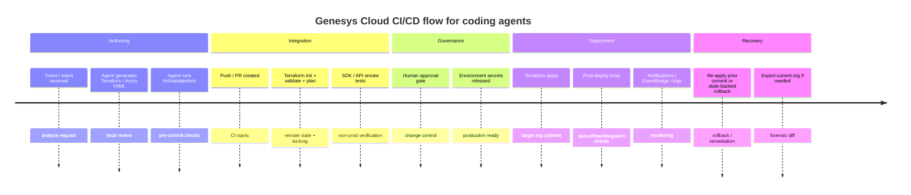

# Genesys Cloud CX as Code for Coding Agents and CI/CD Automation

## Executive summary

Genesys Cloud’s public, official “CX as Code” story is centered on the **Genesys Cloud Terraform provider** (`mypurecloud/genesyscloud`), which Genesys documents as the tool for declaratively managing Genesys Cloud resources across organizations using Terraform. The provider is open source, publishes examples and generated docs, uses the Genesys Cloud **Public Platform API** for CRUD operations, and supports export of existing org configuration into Terraform JSON or HCL through `genesyscloud_tf_export`. As of June 30, 2026, the public GitHub repo shows a recent **v1.84.0** release, indicating active maintenance.

For coding agents such as Claude Code, Codex, and Cursor, the most reliable automation approach is to treat **Terraform as the source of truth**, use **Archy YAML** where Architect flow authoring is involved, and then drive validation, plan, approval, and apply steps through CI/CD. Genesys provides public, official examples of this pattern through a **GitHub Actions + Terraform Cloud** blueprint and an **AWS CodePipeline/CodeBuild + S3 backend** blueprint. The GitHub Actions blueprint explicitly shows environment-specific credentials, Terraform-backed deployment jobs, and post-deploy platform tests implemented with the official Python SDK before promotion to the next environment.

The broader automation surface is larger than Terraform alone. Genesys publicly exposes a **REST-based Platform API** as its primary application interface, publishes an **OpenAPI 2.0 definition** used to generate SDKs, and ships official SDKs for JavaScript, Python, Go, Java, .NET, and iOS, plus a standalone CLI. Architect-specific YAML automation is handled by **Archy**, which is explicitly documented for automation environments and JSON result output. These tools make it practical for coding agents to generate Terraform, export current state, validate flows, run API-based smoke tests, and automate promotion between environments.

The strongest public recommendation today is therefore:

1. Model Genesys Cloud config in **Terraform HCL**.
2. Keep **Architect flows in YAML** and reference them from `genesyscloud_flow`.
3. Use **`genesyscloud_tf_export`** to bootstrap existing orgs and detect drift candidates.
4. Use **client-credentials OAuth** with narrowly scoped roles/divisions and CI secret stores.
5. Use **remote state + locking** and environment promotion with approvals.
6. Use the official SDKs/CLI for **testing, smoke checks, and observability** around the Terraform run.

## Scope and reference architecture

In the official public documentation reviewed, **CX as Code** means using Terraform with the Genesys Cloud provider to manage Genesys Cloud objects such as queues, users, integrations, web deployments, OAuth clients, Architect flows, AI guides, and many other resources exposed by the provider. Genesys also recommends the provider as the foundation for CI/CD automation in its public DevOps guide and blueprints.

The provider itself is not a separate control plane. It is a thin-but-opinionated IaC layer over the **Genesys Cloud Public API**. Genesys states that the Platform API is REST-based and is the primary application interface, and the provider README says the provider performs all CRUD by making Public API calls. The provider docs are also generated from resource schemas, examples, and the Swagger/OpenAPI definition, including automatic extraction of required permissions and OAuth scopes per resource.

A practical reference architecture for coding agents looks like this:



At a deeper technical level, the architecture has four layers. The first is the **authoring layer**: Terraform modules, Archy YAML flow files, variables, and optional test code. The second is the **execution layer**: Terraform CLI, the provider, Archy, and SDK/CLI-based test scripts. The third is the **state and promotion layer**: remote state backends, Terraform Cloud or another state backend, workspaces or equivalent environment isolation, and branch/environment approvals. The fourth is the **runtime verification layer**: Platform API checks, Notifications/EventBridge subscriptions, and operational telemetry or usage monitoring.

A key boundary matters for agent design: **Terraform manages configuration state**, while SDKs/CLI are best used for **procedural validation**, **bulk inspection**, **exports**, and **operational smoke tests**. That separation leads to much safer automation than having an agent make ad hoc mutation calls directly to production APIs. Terraform’s plan/apply workflow and state model are explicitly designed for this review-and-apply pattern.

## Supported IaC and automation toolchain

### Tool support landscape

The following matrix summarizes what is publicly supported or reasonably supportable from coding agents.

| Tool or pattern | Public support status | What it is good for | Key limitations | Primary evidence |
|---|---|---|---|---|
| **Terraform + Genesys Cloud provider** | **Official, primary** | Full Genesys Cloud IaC lifecycle, export/import bootstrap, CI/CD promotion, modules, drift review via plan | Coverage is only as broad as provider resource support; some resources/features may lag API availability | |
| **Archy YAML** | **Official, complementary** | Authoring Architect flows as YAML, automation-friendly flow packaging, CI validation, JSON result output | It is not a full org-wide IaC system; it is focused on Architect artifacts | |
| **Platform API + SDKs + CLI** | **Official** | Test harnesses, smoke tests, exports, scripting, procedural checks, custom automation where Terraform is not ideal | Procedural mutation is harder to review/govern than Terraform plans; requires careful permission design | |
| **Pulumi** | **Indirect / orchestration pattern** | Wrapping Terraform workflows, HCL conversion experiments, stack/secrets orchestration, embedding infra workflows in app code | In the public sources reviewed, no official Genesys-supported Pulumi package/provider surfaced; use carefully and treat Terraform as canonical | |
| **ARM / Bicep / CloudFormation** | **No direct Genesys Cloud config engine found** | Deploying surrounding cloud infrastructure in blueprints, especially AWS components | Public sources reviewed do not show ARM/Bicep/CloudFormation as first-class IaC for Genesys org objects; they appear around adjunct cloud resources, not as replacements for the Genesys Terraform provider | |

### Terraform as the canonical implementation

Terraform is clearly the official anchor. Genesys documents CX as Code as Terraform-based, the provider requires Terraform 1.x, and the provider supports provider-level configuration for auth, proxy/gateway routing, token pools, pagination concurrency, SDK debug logging, and eventual-consistency retry controls. The provider docs also expose resource-specific API endpoints, scopes, and permissions, which is especially valuable for coding agents that need to generate least-privilege role designs.

A distinctive Genesys capability is **`genesyscloud_tf_export`**, which can export existing configuration into Terraform config and optionally a state file. The export can be filtered by resource type, regex, or explicit IDs; can include dependency resolution for flows; can split files by resource; can rewrite selected exported resources as data sources; and can export JSON, HCL, or JSON-HCL variants. This is one of the most useful tools for coding agents because it lets them start from real org state instead of inventing configuration from scratch.

Architect flow support is especially important. The `genesyscloud_flow` resource uses YAML files, supports substitutions, can point to S3 paths, and documents a `force_unlock` behavior that mirrors Archy’s publication behavior. The provider’s export guidance and blog record that Architect flow export was improved, including downloading flow configuration files as part of exports when the newer exporter path is used.

### Pulumi viability

Pulumi is viable as an advanced orchestration layer, but not as a first-class Genesys Cloud control surface in the official public evidence reviewed. Pulumi documents **Automation API**, **state/backends**, **stacks**, **ESC secrets/configuration**, and **Terraform coexistence/provider sharing/HCL conversion**. That means a team can wrap a Terraform-based Genesys project with Pulumi workflows, or selectively convert HCL if they deliberately accept the maintenance cost. However, because I did not locate an official Genesys-supported Pulumi provider/package in the sources reviewed, the lowest-risk posture is to keep Terraform as the canonical Genesys artifact and use Pulumi only for orchestration or adjacent infrastructure if your platform team is already standardized on Pulumi.

### REST and CLI automation

Genesys supports robust non-IaC automation as well. The Platform API is REST-based, is described by an OpenAPI definition, and powers the official SDKs and CLI. The CLI supports CRUD-style operations, multi-profile auth, environment-variable overrides, logging, and progress indication. That makes it helpful for coding agents that need to inspect org state, run targeted checks, or bootstrap scripts around the Terraform lifecycle.

On **GraphQL**, I did not locate an official, public Genesys Cloud GraphQL management interface in the official sources reviewed for this report. The public interface Genesys explicitly documents and ships SDKs/CLI for is the REST Platform API. For coding-agent automation, use REST, the official SDKs, or the provider rather than assuming GraphQL support.

## Official APIs, SDKs, CLI, templates, and example repositories

### Official APIs and what they map to

Genesys positions the **Platform API** as the primary application interface. Public docs describe common use cases, rate limits, notifications, preview APIs, and API Explorer support. For CI/CD and agent workflows, the most relevant API families are:

- **Core configuration APIs** under `/api/v2/...` for users, queues, routing, integrations, web deployments, OAuth clients, and many other admin objects.
- **Architect/flow APIs**, including `/api/v2/flows`, export jobs, publication jobs, flow log-level settings, and dependency tracking. These are directly surfaced by `genesyscloud_flow`.
- **Integration and Data Actions APIs**, including integrations, credentials, actions, drafts, function upload/publish endpoints, and data-action-related resources. These are surfaced by `genesyscloud_integration`, `genesyscloud_integration_credential`, and `genesyscloud_integration_action`.
- **OAuth and authorization APIs**, including OAuth clients, scopes, and role/division assignment for client-credentials automation.
- **Notifications and event-driven APIs**, including WebSocket notifications and Amazon EventBridge integration for backend event delivery.

The provider’s generated docs are unusually valuable here because they list the exact API endpoints, permissions, and OAuth scopes each Terraform resource uses. For coding agents, that means you can automatically derive or review least-privilege service accounts from resource choices rather than discovering missing scopes at runtime.

### SDKs and CLI

Genesys publicly lists official Platform SDKs for **JavaScript, Java/Android, Go, .NET, Python, and iOS**, plus the **Platform API CLI**. The SDK repos expose current package versions, authentication patterns, preview-API caveats, and language-specific retry/logging behavior.

The language choices are not equal for coding-agent automation:

| SDK / tool | Best use in CI/CD | Notable traits | Evidence |
|---|---|---|---|
| **Python SDK** | Smoke tests, workflow assertions, quick admin/test scripts | Simple client-credentials examples; good fit for pipeline test steps | |
| **JavaScript SDK** | Node-based tooling and scripts | Client credentials only in Node, not browser, for security reasons | |
| **Go SDK** | Custom tooling, exporters, robust service automation | Built-in retry configuration and logging controls | |
| **Java SDK** | Enterprise services or platform tooling | Region host helpers and client-credentials helper | |
| **.NET SDK** | Enterprise backends, internal admin tools | Generated from public Swagger; auth-code examples and refresh handling | |
| **CLI** | Ad hoc inspection, bulk scripting, pipeline glue | POSIX-style commands, CRUD/list behavior, profiles, logging, progress tracing | |

### Official templates and example repositories

Genesys publishes a strong public set of examples that coding agents can mine safely:

| Repository or asset | Why it matters | Evidence |
|---|---|---|
| **`MyPureCloud/terraform-provider-genesyscloud`** | Canonical provider source, docs, examples, release cadence, prompts, debugging guide | |
| **Provider examples directory** | Official, schema-conformant examples tested in integration tests | |
| **`GenesysCloudBlueprints/cx-as-code-cicd-gitactions-blueprint`** | Official CI/CD reference using GitHub Actions + Terraform Cloud + SDK-based platform tests | |
| **`GenesysCloudBlueprints/aws-pipeline-cx-as-code-blueprint`** | Official AWS CodePipeline/CodeBuild example with S3 backend | |
| **`GenesysCloudBlueprints/simple-ivr-deploy-with-cx-as-code-blueprint`** | Official end-to-end Terraform + CX as Code solution pattern | |
| **`GenesysCloudBlueprints/architect-flow-public-api-blueprint`** | Official Data Actions + Architect + Terraform example | |
| **`GenesysCloudDevOps/*` remote modules** | Public modules for integrations, Lambda, EventBridge, public API data actions | |
| **`MyPureCloud/developercenter-tutorials`** | Official tutorial source repo used by the Developer Center | |
| **`MyPureCloud/quick-hits-cli`** | Public CLI recipes, including shell/PowerShell-style usage patterns | |

For advanced teams that want to extend the provider itself, Genesys also publishes a **CX as Code resource generator**, which produces provider boilerplate from YAML config and public/preview Swagger definitions. That is not a runtime IaC engine for your orgs, but it is useful if a coding agent is helping your team contribute a missing resource to the provider.

## Security, authentication, and least-privilege design

The provider requires an OAuth client configured with the **Client Credentials** grant, and Genesys explicitly describes client credentials as the appropriate flow for non-user, headless applications such as services, scheduled tasks, and CI/CD jobs. Genesys also notes that administrators assign minimum required roles and can associate those roles with specific divisions to control data access for client-credentials clients.

A sound security model for coding-agent CI/CD in Genesys Cloud has five parts.

First, create **separate OAuth clients per environment** such as dev, test, and prod. The official GitHub Actions blueprint follows that pattern with separate GitHub secrets for dev and test credentials. This prevents accidental cross-environment writes and lets you review environment permissions independently.

Second, drive permissions from **resource-level scope needs**. The provider docs enumerate the exact scopes and permissions needed for each resource. For example, `genesyscloud_flow` needs `architect` scopes and Architect job/flow permissions; `genesyscloud_integration_action` needs integration scopes plus `upload`; and AI guide resources need `ai-studio` scopes. This is much safer than assigning one broad admin role to every pipeline.

Third, avoid exposing secrets in Terraform state unless you explicitly choose to do so. The `genesyscloud_oauth_client` resource documents `expose_client_secret = true` as a sensitive output option and explicitly warns that this stores the secret in Terraform state. In normal pipelines, keep that disabled and inject existing secrets from the CI system or a secret manager instead. HashiCorp likewise warns that backend credentials and sensitive backend config should be supplied through environment variables rather than hardcoded or injected via backend config files because Terraform writes backend configuration in plain text to local metadata and plan artifacts.

Fourth, use your CI platform’s first-class secret and approval mechanisms rather than plain variables. GitHub Actions supports repository, environment, and organization secrets, and protected environments can require reviewers before jobs can access environment secrets. GitLab recommends masking, hiding, and protecting CI/CD variables and supports deployment approvals for protected environments. Azure DevOps supports secret variables, variable groups, Key Vault integration, and approvals/checks that are managed outside YAML. Jenkins recommends credentials stores and credentials binding rather than hardcoded values in Jenkinsfiles.

Fifth, tune provider concurrency carefully. The provider supports a token pool and concurrent pagination, but the docs state that each token in the pool is minted at startup by the OAuth client-credentials endpoint and that unnecessarily large pools can increase startup time and trigger OAuth rate limiting during prefill. Match `token_pool_size` to actual parallelism needs rather than setting it aggressively. Genesys also documents platform rate limits generally and explains that the platform imposes limits to protect stability.

A practical least-privilege approach for enterprise pipelines is to maintain **one OAuth client per environment and deployment lane**, with roles scoped only to the resource families deployed by that lane. For example, a “flows-only” pipeline can carry Architect and referenced lookup permissions without broad telephony or outbound-admin rights. That design is directly enabled by the provider’s generated permission lists.

## CI/CD implementation patterns and multi-platform pipeline examples

### Recommended pipeline pattern

The most defensible CI/CD design for Genesys Cloud is a **reviewable, state-backed, environment-specific pipeline**:

1. Generate or edit Terraform/Archy artifacts in a feature branch.
2. Run `terraform fmt`, `terraform validate`, and optional `terraform test`.
3. Run `terraform plan` against a remote backend/workspace for the target environment.
4. Run SDK/CLI/REST smoke tests in a non-production org after apply.
5. Require an approval gate before production.
6. Apply the reviewed plan in production.
7. Run post-deploy verification and capture logs/events.

The official GitHub Actions blueprint demonstrates this pattern directly. It uses three jobs: deploy to dev, run platform tests, then deploy to test. It ships local composite actions to run Terraform and install platform tooling, and the Python platform test checks real objects such as queues and integration actions after deployment.

The official AWS blueprint shows an alternate implementation using CodePipeline/CodeBuild, Terraform, and an S3 backend. The included `buildspec.yml` installs Terraform, runs `terraform init`, `terraform plan`, and `terraform apply -auto-approve`, while `provider.tf` configures the S3 backend and the Genesys provider.

### Sample GitHub Actions workflow

This sample reflects the official Genesys pattern, but adds an explicit plan artifact and a production approval-friendly environment stage. The secrets model maps directly to GitHub’s environment/repository secret features.

```yaml
name: genesys-cloud-cicd

on:
  pull_request:
  push:
    branches: [main]

jobs:
  plan-dev:
    runs-on: ubuntu-latest
    environment: dev
    env:
      GENESYSCLOUD_OAUTHCLIENT_ID: ${{ secrets.GENESYSCLOUD_OAUTHCLIENT_ID }}
      GENESYSCLOUD_OAUTHCLIENT_SECRET: ${{ secrets.GENESYSCLOUD_OAUTHCLIENT_SECRET }}
      GENESYSCLOUD_REGION: us-west-2
    steps:
      - uses: actions/checkout@v4
      - uses: hashicorp/setup-terraform@v3
      - run: terraform -chdir=infra/dev init
      - run: terraform -chdir=infra/dev fmt -check
      - run: terraform -chdir=infra/dev validate
      - run: terraform -chdir=infra/dev plan -out=tfplan
      - uses: actions/upload-artifact@v4
        with:
          name: dev-tfplan
          path: infra/dev/tfplan

  apply-dev:
    if: github.ref == 'refs/heads/main'
    needs: plan-dev
    runs-on: ubuntu-latest
    environment: dev
    env:
      GENESYSCLOUD_OAUTHCLIENT_ID: ${{ secrets.GENESYSCLOUD_OAUTHCLIENT_ID }}
      GENESYSCLOUD_OAUTHCLIENT_SECRET: ${{ secrets.GENESYSCLOUD_OAUTHCLIENT_SECRET }}
      GENESYSCLOUD_REGION: us-west-2
    steps:
      - uses: actions/checkout@v4
      - uses: hashicorp/setup-terraform@v3
      - run: terraform -chdir=infra/dev init
      - run: terraform -chdir=infra/dev apply -auto-approve

  smoke-dev:
    if: github.ref == 'refs/heads/main'
    needs: apply-dev
    runs-on: ubuntu-latest
    environment: dev
    env:
      GENESYSCLOUD_OAUTHCLIENT_ID: ${{ secrets.GENESYSCLOUD_OAUTHCLIENT_ID }}
      GENESYSCLOUD_OAUTHCLIENT_SECRET: ${{ secrets.GENESYSCLOUD_OAUTHCLIENT_SECRET }}
      GENESYSCLOUD_REGION: us-west-2
    steps:
      - uses: actions/checkout@v4
      - run: pip install PureCloudPlatformClientV2
      - run: python tests/genesys_smoke.py

  apply-prod:
    if: github.ref == 'refs/heads/main'
    needs: smoke-dev
    runs-on: ubuntu-latest
    environment: prod
    env:
      GENESYSCLOUD_OAUTHCLIENT_ID: ${{ secrets.GENESYSCLOUD_OAUTHCLIENT_ID }}
      GENESYSCLOUD_OAUTHCLIENT_SECRET: ${{ secrets.GENESYSCLOUD_OAUTHCLIENT_SECRET }}
      GENESYSCLOUD_REGION: us-east-1
    steps:
      - uses: actions/checkout@v4
      - uses: hashicorp/setup-terraform@v3
      - run: terraform -chdir=infra/prod init
      - run: terraform -chdir=infra/prod apply -auto-approve
```

### Sample Jenkinsfile

This pattern uses Jenkins credentials binding and an explicit human approval with the `input` step before production. That aligns with Jenkins guidance on credentials usage and manual pipeline control.

```groovy
pipeline {
  agent any

  stages {
    stage('Validate') {
      steps {
        withCredentials([
          string(credentialsId: 'genesys-dev-client-id', variable: 'GENESYSCLOUD_OAUTHCLIENT_ID'),
          string(credentialsId: 'genesys-dev-client-secret', variable: 'GENESYSCLOUD_OAUTHCLIENT_SECRET')
        ]) {
          sh '''
            export GENESYSCLOUD_REGION=us-west-2
            terraform -chdir=infra/dev init
            terraform -chdir=infra/dev fmt -check
            terraform -chdir=infra/dev validate
            terraform -chdir=infra/dev plan -out=tfplan
          '''
        }
      }
    }

    stage('Apply Dev') {
      when { branch 'main' }
      steps {
        withCredentials([
          string(credentialsId: 'genesys-dev-client-id', variable: 'GENESYSCLOUD_OAUTHCLIENT_ID'),
          string(credentialsId: 'genesys-dev-client-secret', variable: 'GENESYSCLOUD_OAUTHCLIENT_SECRET')
        ]) {
          sh '''
            export GENESYSCLOUD_REGION=us-west-2
            terraform -chdir=infra/dev init
            terraform -chdir=infra/dev apply -auto-approve
          '''
        }
      }
    }

    stage('Approve Prod') {
      when { branch 'main' }
      steps {
        input message: 'Promote Genesys Cloud change to production?'
      }
    }

    stage('Apply Prod') {
      when { branch 'main' }
      steps {
        withCredentials([
          string(credentialsId: 'genesys-prod-client-id', variable: 'GENESYSCLOUD_OAUTHCLIENT_ID'),
          string(credentialsId: 'genesys-prod-client-secret', variable: 'GENESYSCLOUD_OAUTHCLIENT_SECRET')
        ]) {
          sh '''
            export GENESYSCLOUD_REGION=us-east-1
            terraform -chdir=infra/prod init
            terraform -chdir=infra/prod apply -auto-approve
          '''
        }
      }
    }
  }
}
```

### Sample GitLab CI

This pattern uses CI/CD variables, protected environments, and deployment approvals. GitLab’s environment and approval model maps well to Genesys environment promotion.

```yaml
stages:
  - validate
  - deploy_dev
  - smoke
  - deploy_prod

validate:
  stage: validate
  image: hashicorp/terraform:latest
  script:
    - cd infra/dev
    - terraform init
    - terraform fmt -check
    - terraform validate
    - terraform plan -out=tfplan
  variables:
    GENESYSCLOUD_REGION: "us-west-2"

deploy_dev:
  stage: deploy_dev
  image: hashicorp/terraform:latest
  environment:
    name: dev
  script:
    - cd infra/dev
    - terraform init
    - terraform apply -auto-approve
  variables:
    GENESYSCLOUD_REGION: "us-west-2"
  rules:
    - if: '$CI_COMMIT_BRANCH == "main"'

smoke_dev:
  stage: smoke
  image: python:3.12
  environment:
    name: dev
  script:
    - pip install PureCloudPlatformClientV2
    - python tests/genesys_smoke.py
  rules:
    - if: '$CI_COMMIT_BRANCH == "main"'

deploy_prod:
  stage: deploy_prod
  image: hashicorp/terraform:latest
  environment:
    name: production
  script:
    - cd infra/prod
    - terraform init
    - terraform apply -auto-approve
  variables:
    GENESYSCLOUD_REGION: "us-east-1"
  rules:
    - if: '$CI_COMMIT_BRANCH == "main"'
```

### Sample Azure DevOps pipeline

This pattern uses secret variables or variable groups and relies on Azure approvals/checks outside YAML for production governance.

```yaml
trigger:
  branches:
    include:
      - main

stages:
- stage: ValidateDev
  jobs:
  - job: Validate
    pool:
      vmImage: ubuntu-latest
    steps:
      - checkout: self
      - script: |
          cd infra/dev
          terraform init
          terraform fmt -check
          terraform validate
          terraform plan -out=tfplan
        env:
          GENESYSCLOUD_OAUTHCLIENT_ID: $(GENESYSCLOUD_OAUTHCLIENT_ID_DEV)
          GENESYSCLOUD_OAUTHCLIENT_SECRET: $(GENESYSCLOUD_OAUTHCLIENT_SECRET_DEV)
          GENESYSCLOUD_REGION: us-west-2

- stage: DeployDev
  dependsOn: ValidateDev
  jobs:
  - job: ApplyDev
    pool:
      vmImage: ubuntu-latest
    steps:
      - checkout: self
      - script: |
          cd infra/dev
          terraform init
          terraform apply -auto-approve
        env:
          GENESYSCLOUD_OAUTHCLIENT_ID: $(GENESYSCLOUD_OAUTHCLIENT_ID_DEV)
          GENESYSCLOUD_OAUTHCLIENT_SECRET: $(GENESYSCLOUD_OAUTHCLIENT_SECRET_DEV)
          GENESYSCLOUD_REGION: us-west-2

- stage: DeployProd
  dependsOn: DeployDev
  jobs:
  - job: ApplyProd
    pool:
      vmImage: ubuntu-latest
    steps:
      - checkout: self
      - script: |
          cd infra/prod
          terraform init
          terraform apply -auto-approve
        env:
          GENESYSCLOUD_OAUTHCLIENT_ID: $(GENESYSCLOUD_OAUTHCLIENT_ID_PROD)
          GENESYSCLOUD_OAUTHCLIENT_SECRET: $(GENESYSCLOUD_OAUTHCLIENT_SECRET_PROD)
          GENESYSCLOUD_REGION: us-east-1
```

## Agent workflows, prompts, and multi-language examples

### High-confidence workflow for coding agents

A coding agent should not start by generating complex Terraform from a blank prompt. The most reliable sequence is:

1. **Bootstrap from reality**. If the org already exists, use `genesyscloud_tf_export` to export the relevant subset, preferably in HCL, with filtering and, when needed, dependency resolution for flows. This gives the agent real names, IDs, and patterns.
2. **Normalize into modules**. Split exported or existing code into modules by domain: routing, users/roles, Architect flows, data actions/integrations, web deployments, AI guides, and environment overlays. Terraform examples and workspaces make this model practical.
3. **Generate or update flow YAML**. For Architect-heavy work, let the agent edit Archy/flow YAML and reference it from `genesyscloud_flow` with substitutions rather than embedding every nuance directly into HCL.
4. **Validate before mutation**. Run `terraform fmt`, `terraform validate`, optional `terraform test`, and SDK/CLI/API smoke tests against a non-prod org first.
5. **Promote with approvals**. Use CI environments and approvals for production.
6. **Keep API-side scripts procedural and read-focused**. Use SDK/CLI scripts for assertions, inventory, and health checks, not as the primary mutation path when Terraform covers the same resource class.

### Prompt templates for Claude Code, Codex, and Cursor

These prompts are deliberately structured so the agent uses official artifacts as grounding data and produces reviewable changes.

#### Prompt for repository bootstrap

```text
You are working on a Genesys Cloud CX as Code repository.

Goal:
- Bootstrap a maintainable Terraform codebase for Genesys Cloud CI/CD.
- Prefer official Genesys Cloud Terraform provider patterns.
- Treat Terraform as the source of truth.
- Use flow YAML files for Architect flows via genesyscloud_flow.
- Generate code that is safe for CI/CD and environment promotion.

Tasks:
- Create a repo layout with modules for routing, architect-flows, integrations-data-actions, web-messaging, oauth, and shared variables.
- Add provider configuration using environment variables only; do not hardcode credentials.
- Add remote-state placeholders and environment overlays for dev/test/prod.
- Add terraform fmt/validate/test targets.
- Add a smoke-test script in Python using PureCloudPlatformClientV2.
- Add documentation that maps each module to the Genesys Cloud APIs/scopes it needs.
- If importing an existing org, include a genesyscloud_tf_export bootstrap example using HCL export and filtered resources.

Constraints:
- Do not invent unsupported Genesys resources.
- Prefer official provider resource names.
- Keep secrets out of Terraform state unless explicitly required.
- Output a file tree first, then the code.
```

#### Prompt for implementing a change request

```text
Implement the following Genesys Cloud change as Terraform and supporting tests:

Change request:
- [paste ticket]

Requirements:
- Update only the minimum affected modules.
- If Architect flows are involved, edit the YAML and use substitutions.
- If a referenced object already exists and should not be managed, use a data source instead.
- Produce:
  1) Terraform code
  2) Any updated flow YAML
  3) A terraform plan review checklist
  4) Python smoke tests using the official SDK
  5) Rollback notes

Validation:
- terraform fmt
- terraform validate
- suggest terraform test cases where relevant
- add post-deploy checks that call the Platform API

Do not apply broad admin permissions. Infer likely scopes/permissions from the provider docs for the selected resources.
```

#### Prompt for promotion and rollback preparation

```text
Prepare this Genesys Cloud Terraform change for environment promotion.

Tasks:
- Review module inputs for dev/test/prod differences.
- Generate a promotion checklist from dev -> test -> prod.
- Add CI approval gates and environment secret references.
- Generate rollback instructions:
  - redeploy prior Git commit
  - restore prior Terraform state if necessary
  - run verification scripts after rollback
- Highlight any resources where rename/destructive replacement is likely.
- Flag any use of oauth client secret exposure or state-sensitive data.

Output:
- markdown runbook
- updated CI pipeline file
- verification commands
```

### Terraform HCL example

The following example shows a clean provider block, an export bootstrap block, an integration, an integration credential, and a Data Action-style resource pattern grounded in official provider capabilities. The provider supports environment-variable auth, export to HCL/JSON, filtering, dependency resolution, and integrations/credentials/actions resources.

```hcl
terraform {
  required_version = ">= 1.5.0"

  required_providers {
    genesyscloud = {
      source  = "mypurecloud/genesyscloud"
      version = "~> 1.84"
    }
  }

  backend "s3" {}
}

provider "genesyscloud" {
  aws_region            = var.genesys_region
  custom_retry_timeout  = "5m"
  token_pool_size       = 4
  max_concurrent_pages  = 4
  sdk_debug             = false
}

variable "genesys_region" {
  type = string
}

resource "genesyscloud_tf_export" "bootstrap_routing" {
  directory                    = "./bootstrap/routing"
  export_format                = "hcl"
  log_permission_errors        = true
  include_filter_resources     = ["genesyscloud_routing_queue::Support.*"]
  include_state_file           = false
  enable_dependency_resolution = false
}

resource "genesyscloud_integration_credential" "purecloud_oauth" {
  name                 = "gc-data-actions-credential"
  credential_type_name = "pureCloudOAuthClient"
  fields = {
    clientId     = var.gc_oauth_client_id
    clientSecret = var.gc_oauth_client_secret
  }
}

resource "genesyscloud_integration" "gc_data_actions" {
  intended_state   = "ENABLED"
  integration_type = "purecloud-data-actions"

  config {
    credentials = {
      pureCloudOAuthClient = genesyscloud_integration_credential.purecloud_oauth.id
    }
  }
}

resource "genesyscloud_integration_action" "lookup_queue" {
  name           = "LookupQueueName"
  category       = "TerraformManaged"
  integration_id = genesyscloud_integration.gc_data_actions.id

  config_request {
    request_type_url_template = "/api/v2/routing/queues/${input.QUEUE_ID}"
    request_template          = "{}"
    request_type              = "GET"
  }

  config_response {
    success_template = "{\"queueName\": \"${name}\"}"
  }

  contract_input = jsonencode({
    type       = "object"
    required   = ["QUEUE_ID"]
    properties = {
      QUEUE_ID = { type = "string" }
    }
  })

  contract_output = jsonencode({
    type       = "object"
    properties = {
      queueName = { type = "string" }
    }
  })

  secure = false
}

resource "genesyscloud_flow" "inbound_call" {
  filepath = "${path.module}/flows/inboundcall.yaml"

  substitutions = {
    flow_name = "Support Inbound Call"
  }
}
```

### Pulumi-oriented examples

Because I did **not** locate a public, official Genesys-supported Pulumi provider/package in the sources reviewed, the safest Pulumi pattern is to use Pulumi as an **orchestration layer around the canonical Terraform Genesys project**, or to convert/manage HCL selectively if your platform team already uses Pulumi heavily. Pulumi officially supports Automation API, Terraform coexistence, and HCL conversion.

#### TypeScript orchestration example

```ts
import { execFileSync } from "node:child_process";
import * as path from "node:path";

const env = {
  ...process.env,
  GENESYSCLOUD_OAUTHCLIENT_ID: process.env.GENESYSCLOUD_OAUTHCLIENT_ID!,
  GENESYSCLOUD_OAUTHCLIENT_SECRET: process.env.GENESYSCLOUD_OAUTHCLIENT_SECRET!,
  GENESYSCLOUD_REGION: process.env.GENESYSCLOUD_REGION || "us-west-2",
};

const projectDir = path.resolve("infra/dev");

function tf(args: string[]) {
  execFileSync("terraform", args, {
    cwd: projectDir,
    env,
    stdio: "inherit",
  });
}

tf(["init"]);
tf(["fmt", "-check"]);
tf(["validate"]);
tf(["plan", "-out=tfplan"]);
tf(["apply", "-auto-approve"]);
```

#### Python orchestration example

```python
import os
import subprocess
from pathlib import Path

project_dir = Path("infra/dev").resolve()

env = os.environ.copy()
env["GENESYSCLOUD_OAUTHCLIENT_ID"] = os.environ["GENESYSCLOUD_OAUTHCLIENT_ID"]
env["GENESYSCLOUD_OAUTHCLIENT_SECRET"] = os.environ["GENESYSCLOUD_OAUTHCLIENT_SECRET"]
env["GENESYSCLOUD_REGION"] = os.environ.get("GENESYSCLOUD_REGION", "us-west-2")

def tf(*args: str) -> None:
    subprocess.run(
        ["terraform", *args],
        cwd=project_dir,
        env=env,
        check=True,
    )

tf("init")
tf("fmt", "-check")
tf("validate")
tf("plan", "-out=tfplan")
tf("apply", "-auto-approve")
```

### REST example

Genesys documents the OAuth client-credentials grant for headless apps, and the Platform API is the official mutation/inspection surface underneath the provider. The example below shows a token request and a simple configuration read.

```bash
# Get an access token
curl -s -u "$GENESYSCLOUD_OAUTHCLIENT_ID:$GENESYSCLOUD_OAUTHCLIENT_SECRET" \
  -d "grant_type=client_credentials" \
  "https://login.mypurecloud.com/oauth/token"

# Use the token to read queues
curl -s \
  -H "Authorization: Bearer $TOKEN" \
  "https://api.mypurecloud.com/api/v2/routing/queues?pageSize=25"
```

A practical agent pattern is to use REST like this only for **verification** or when building a test harness around Terraform. If the provider already supports the object you want, prefer the Terraform representation so you keep drift review, state, and approvals.

### Python smoke test example

Official Genesys examples use the Python SDK in pipeline verification. The sample below mirrors that pattern.

```python
import os
import PureCloudPlatformClientV2

client = PureCloudPlatformClientV2.api_client.ApiClient().get_client_credentials_token(
    os.environ["GENESYSCLOUD_OAUTHCLIENT_ID"],
    os.environ["GENESYSCLOUD_OAUTHCLIENT_SECRET"],
)

routing_api = PureCloudPlatformClientV2.RoutingApi(client)
integrations_api = PureCloudPlatformClientV2.IntegrationsApi(client)

def find_queue(name: str):
    results = routing_api.get_routing_queues(name=name)
    return results.entities[0] if len(results.entities) == 1 else None

def find_action(name: str):
    results = integrations_api.get_integrations_actions(name=name)
    return results.entities[0] if len(results.entities) == 1 else None

assert find_queue("Support") is not None
assert find_action("LookupQueueName") is not None
print("Genesys Cloud smoke test passed")
```

## Engineering practices for testing, rollback, promotion, observability, and cost

### Testing strategy

A strong testing posture has three layers.

The first layer is **static validation**: `terraform fmt`, `terraform validate`, and optional `terraform test`. HashiCorp documents Terraform test files and the `terraform test` command for validating module behavior. Genesys’ own provider examples are also validated through plan-only, acceptance, and audit-style tests.

The second layer is **real acceptance testing in a non-prod org**. Genesys explicitly notes that provider acceptance tests modify real resources in a test org and require an OAuth client authorized to create, update, and delete the resource type. That same principle should guide enterprise CI: always have at least one disposable or lower-risk org for apply-and-verify testing.

The third layer is **post-deploy platform smoke tests**. The public GitHub Actions blueprint’s `platform_tests.py` is the clearest official expression of this practice: after Terraform applies to dev, the pipeline calls the Platform API via the Python SDK and asserts that queues and integration actions exist and have expected names.

### Rollback and recovery

Terraform rollback in Genesys Cloud is primarily a **Git + state discipline**, not a magical one-click undo. HashiCorp’s model is to review plans, apply tracked changes, and restore desired state through configuration and valid state management. For Genesys Cloud specifically, that means your practical rollback options are:

- revert to a previous Git commit and re-apply;
- restore or repair remote state where appropriate;
- use `terraform force-unlock` only with caution when a lock is orphaned;
- if necessary, export current org state with `genesyscloud_tf_export` to compare drift before remediation.

Be especially careful with resources whose names imply replacement semantics. For example, the `genesyscloud_flow` docs note that changing the flow name results in creation of a new flow with a new GUID while the original persists. That is not a “rollback bug”; it is a resource-behavior characteristic your review process must account for.

### Versioning and environment promotion

Use **Git tags/commits** for release identity, **remote state backends** for state integrity, and either **Terraform workspaces** or clearly separated working directories/workspaces per environment. HashiCorp distinguishes Terraform CLI workspaces from HCP Terraform workspaces, but both support environment separation patterns. Genesys’ public GitHub blueprint uses Terraform Cloud workspaces, and the AWS blueprint uses an S3 backend.

The most stable promotion model is not “export prod, mutate, re-import.” It is **promote the same reviewed code** from dev to test to prod with only environment-level inputs changing. The GitHub Actions blueprint embodies this principle by reusing the same Terraform action flow with environment-specific credentials and variables.

### Change management and approvals

Genesys public blueprints are explicit that they are examples, not turnkey production systems. For production governance, combine them with first-class environment approvals:

- **GitHub Actions** environments with required reviewers; jobs cannot access environment secrets until rules pass.
- **GitLab** protected environments and deployment approvals.
- **Azure DevOps** approvals and checks managed outside YAML by resource owners.
- **Jenkins** `input` gates and credentials binding.

This is especially important for production orgs because many Genesys resources are not trivial stateless objects; they affect real routing behavior, user permissions, messaging deployments, or customer-facing IVR/chat flows. The best practice is therefore **non-prod apply + smoke test + manual approval + prod apply**.

### Observability and monitoring

Observability for Genesys Cloud CI/CD is not just pipeline logs. Genesys publicly supports:

- **SDK/CLI/provider logs** for deployment-time diagnostics. The provider supports SDK debug logs and stack-trace logging; the CLI supports profile-specific log files and progress indication.
- **Notifications WebSockets** for real-time UI-oriented event subscriptions.
- **Amazon EventBridge integration** for server-to-server, backend event delivery. Genesys explicitly recommends EventBridge for server-based integrations in the event-based processing guide.
- **Usage and analytics APIs** for operational metrics or platform checks.

A practical observability pattern is to emit pipeline metadata, target commit, target workspace, and applied plan ID into your own logs, then augment that with SDK-based post-deploy checks and event subscriptions or EventBridge routing for operational follow-up. The Terraform run tells you **what changed**; Notifications/EventBridge and runtime smoke tests tell you **whether the platform behaves as intended**.

### Cost considerations

The public evidence reviewed suggests that the main cost drivers are **not** the Genesys Terraform provider itself, which is published as an open-source GitHub project, but rather the surrounding runtime and platform choices: remote-state services such as Terraform Cloud or Pulumi Cloud, CI runners, secret-management systems, and any cloud infrastructure used around the pipelines or eventing patterns, such as S3, CodeBuild, CodePipeline, EventBridge, Lambda, or Azure services shown in blueprints. Some provider resources also clearly map to feature families such as AI Studio, messaging/web deployments, WFM, telephony, or outbound, which may depend on product entitlements or edition capabilities in the target org. That last point is an inference from the public provider examples/resource docs and not a single official edition matrix.

The most important cost-control practices are therefore operational rather than licensing-oriented:

- run full acceptance tests only in designated non-prod orgs;
- avoid oversized token pools and excessive export breadth;
- filter `genesyscloud_tf_export` to the minimum subset needed;
- use event-driven observability selectively rather than spraying every event to downstream systems;
- separate high-change and low-change modules so your pipelines do not need to touch the entire org for every change.

## Open questions and limitations

This report is grounded in official public Genesys docs, public official GitHub repos, Terraform/Pulumi primary docs, and CI-platform primary docs. A few boundaries remain:

- I did **not** locate a public, official Genesys-supported **Pulumi provider/package** in the sources reviewed, so Pulumi guidance here is intentionally framed as an orchestration/coexistence pattern around Terraform rather than as a first-class Genesys-native provider recommendation.
- I did **not** locate an official public **GraphQL** management interface for Genesys Cloud in the reviewed sources; the documented primary interface is REST/OpenAPI.
- Genesys resources evolve quickly, and provider coverage is actively expanding. For any concrete build, pin the provider version explicitly and review the current resource docs and release notes for the exact objects you plan to automate. As of the sources retrieved for this report, the provider repo showed active recent releases up to **v1.84.0**.
- Public docs do not present a single canonical edition/entitlement matrix for every provider resource. For feature families such as AI Studio, advanced messaging, telephony, WFM, or preview APIs, verify org entitlements and preview status before standardizing those resources in production pipelines.

Overall, the highest-confidence conclusion is straightforward: **for coding agents and enterprise-grade CI/CD, Genesys Cloud CX as Code is best implemented as Terraform-first, Archy-assisted for flows, SDK/CLI-backed for tests and observability, and promoted through state-backed, approval-gated pipelines.**