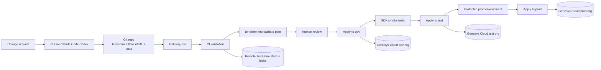
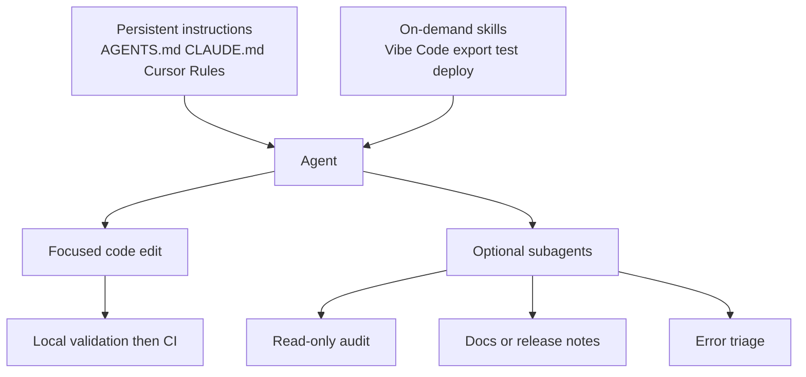

# Vibe Code for Autonomous Genesys Cloud CX as Code

## Executive summary

The strongest way to let coding agents manage Genesys Cloud safely is to make **Terraform with the official Genesys Cloud provider** the system of record, keep Architect flows as **YAML artifacts**, and let agents act primarily as **authors, refactorers, validators, and pull-request operators** rather than as direct mutating API bots. Genesys positions CX as Code as a Terraform-based way to declaratively manage Genesys Cloud resources across organizations, and the official provider performs CRUD through Genesys Cloud Public APIs using OAuth credentials. Genesys’ CI/CD blueprint pairs that provider with GitHub Actions and Terraform Cloud state/locking, then runs platform tests before promotion.

For coding agents specifically, the most effective design is a portable skill bundle—here called **Vibe Code**—that places persistent policy in repository instruction files, puts multi-step deployment logic into reusable **skills**, scopes context by directory, and uses **subagents** only for side tasks that would otherwise flood the main context window. That design maps well to all three major coding-agent ecosystems: Codex uses `AGENTS.md` plus skills, Claude Code uses `CLAUDE.md`, rules, skills, hooks, and subagents, and Cursor supports Rules, `AGENTS.md`, skills, and subagents. All three ecosystems explicitly support reusable skill-like packaging, and both Codex and Claude describe skills as following an open agent-skills standard.

The practical outcome is straightforward. Agents should generate or edit Terraform, flow YAML, tests, and workflow files; CI should run `terraform fmt`, `validate`, `plan`, smoke tests, and drift scans; production should be protected by state locking, environment approvals, and least-privilege OAuth clients. SDKs and direct APIs still matter, but mainly for **verification, diagnostics, and unsupported edge cases** rather than baseline deployment.

## Goals and threat model

The primary goals are consistency across orgs, reviewable changes, deterministic promotion from lower to higher environments, safe brownfield onboarding, and efficient agent operation under limited context windows. Terraform matches those goals because it stores intent in versioned configuration, computes plans before apply, and relies on state to map configuration to live resources. Genesys’ provider documentation also makes clear that the provider is the layer performing public-API CRUD operations on managed resources.

The main risks are not theoretical. They are the everyday failure modes of autonomous configuration change: an agent hardcodes secrets; two agents apply to the same state concurrently; a direct API script drifts away from Terraform state; an Architect flow rename silently creates a new flow and leaves the original one in place; a force-unlock operation republishes an unexpected draft; or a high-privilege OAuth client is reused too broadly across environments. The official provider docs explicitly warn that all CRUD is done through public APIs with required roles, permissions, and OAuth scopes; the `genesyscloud_flow` resource notes that changing the flow name creates a new flow with a new GUID while the original persists; and the flow resource also documents that `force_unlock` mirrors Archy behavior by publishing the draft before publishing the named flow.

That threat model leads to four operating rules. First, **all persistent platform changes should flow through Terraform state**. Second, **all production applies should be serialized and approval-gated**. Third, **all agent guidance should be explicit, local, and reusable** so the model does not rediscover policy every run. Fourth, **all nonessential direct API mutations should be forbidden by default** and reserved for verified break-glass cases or unsupported resources. Terraform state locking, GitHub protected environments with required reviewers, and repository instruction files all directly support those rules.

## Recommended operating model

The recommended model is **Terraform-first, agent-assisted, CI/CD-controlled**. Terraform should own supported Genesys Cloud resources; Archy-style YAML should be the canonical source for Architect flows referenced by Terraform’s `genesyscloud_flow` resource; SDKs should verify outcomes after deployment; and any raw API or CLI automation should be limited to read-only inspection or narrow exceptions where the provider has no coverage. This follows Genesys’ own product positioning for CX as Code, the provider’s implementation model, and the Genesys CI/CD blueprint.

The trade-offs are easiest to see side by side.

| Approach | Strengths | Weaknesses | Best use |
|---|---|---|---|
| Terraform provider | Reviewable plans, managed state, drift workflows, environment promotion, rich resource coverage, YAML flow integration | Requires state discipline and provider coverage | Primary deployment system |
| SDKs | Strong for assertions, diagnostics, and custom verification; generated from Genesys Cloud OpenAPI | Imperative and easier to drift from desired state if used for deployment | Smoke tests, audits, health checks |
| Direct API or CLI | Maximum escape hatch flexibility | Least reviewable, easiest to bypass policy, poor drift ergonomics | Unsupported edge cases and break-glass operations |

The table above is an architectural recommendation, but it is grounded in official behavior: the provider manages resources through Genesys Cloud Public APIs; the SDKs are generated wrappers around the Platform API; and the official CLI exposes get/list/create/update/delete operations.

A practical deployment pipeline looks like this:



Genesys’ published blueprint demonstrates the same core pattern: deploy to a lower environment, run platform tests, then continue promotion; it also uses Terraform Cloud for state and lock management. GitHub environments add required reviewers and optional self-review prevention, which is well suited for production gates.

A few implementation decisions matter disproportionately:

| Decision point | Recommendation | Why |
|---|---|---|
| Desired-state authority | Terraform only | Prevent dual-control drift |
| Flow source | YAML under version control | Easier review and agent editing |
| Secret source | GitHub environment secrets or external secret manager, never committed | Prevent secret exposure |
| State backend | Remote backend with locking | Prevent concurrent corruption |
| Production approval | GitHub protected environment with required reviewers | Keep humans in the loop |
| Agent mutation path | PRs by default, direct apply only in CI | Preserve auditable review trail |

Those recommendations follow official guidance on state storage and locking, backend sensitivity, environment protection rules, and secrets handling. HashiCorp specifically recommends remote backends instead of version control because state can contain sensitive values, and warns that backend credentials passed via backend config can leak into local metadata and plan files. GitHub documents environment-scoped secrets and protected deployments with required reviewers.

## Vibe Code skill architecture

Vibe Code is a **portable skill pack** for coding agents. It is designed so that the same repository can guide Codex through `AGENTS.md`, Claude Code through `CLAUDE.md` and `.claude/` assets, and Cursor through Rules plus `.cursor/skills/`. That portability is realistic because Codex, Claude Code, and Cursor all expose durable project instructions, and both Codex and Claude explicitly describe skills as an open standard. Cursor also supports `SKILL.md`-based skills in `.cursor/skills/`, including nested, directory-scoped skills for monorepos.

A repository layout that works well in practice is:

```text
repo/
├── AGENTS.md
├── CLAUDE.md
├── .cursor/
│   ├── rules/
│   │   ├── genesys-cloud.mdc
│   │   └── terraform-safety.mdc
│   └── skills/
│       └── vibe-code/
│           ├── SKILL.md
│           ├── references/
│           │   ├── provider-cheatsheet.md
│           │   └── release-checklist.md
│           └── scripts/
│               ├── plan.sh
│               └── drift.sh
├── .claude/
│   ├── skills/
│   │   └── vibe-code/
│   │       ├── SKILL.md
│   │       ├── references/
│   │       └── scripts/
│   ├── rules/
│   │   └── genesys-cloud.md
│   └── hooks/
│       └── pre-apply-check.sh
├── infra/
│   ├── modules/
│   │   ├── routing-queue/
│   │   ├── architect-flow/
│   │   └── oauth-client-readonly/
│   ├── environments/
│   │   ├── dev/
│   │   ├── test/
│   │   └── prod/
│   ├── flows/
│   │   ├── inbound-support.yaml
│   │   └── common/
│   ├── tests/
│   │   ├── terraform/
│   │   │   └── queue.tftest.hcl
│   │   ├── smoke/
│   │   │   ├── smoke_python.py
│   │   │   └── smoke_node.mjs
│   │   └── drift/
│   │       └── nightly.sh
│   └── scripts/
│       ├── fmt_validate_plan.sh
│       └── export_brownfield.sh
└── .github/
    └── workflows/
        ├── pr-plan.yaml
        ├── deploy-dev.yaml
        ├── deploy-test.yaml
        ├── deploy-prod.yaml
        └── drift-detection.yaml
```

This structure deliberately separates durable guidance from heavy procedures. That matters for context efficiency. Codex documents `AGENTS.md` as an automatically loaded repository guide and says the best file covers layout, commands, conventions, and constraints. Claude Code says `CLAUDE.md` is for persistent facts, while procedures should move into skills. Codex and Claude both note that skill instructions load only when the skill is used, which reduces context pressure. Cursor provides the same benefit through scoped `SKILL.md` files and rule files attached to matching files or directories.

### Core instruction files

The project-level instruction file should be short, stable, and opinionated.

```markdown
# AGENTS.md

## Mission
Maintain Genesys Cloud through Terraform and reviewable PRs only.

## Always do
- Treat Terraform with source `mypurecloud/genesyscloud` as the source of truth.
- Keep Architect flows in YAML under `infra/flows/` and manage lifecycle with `genesyscloud_flow`.
- Use SDK smoke tests after any apply to dev, test, or prod.
- Run:
  - `terraform fmt -check -recursive`
  - `terraform validate`
  - `terraform plan`
- Prefer the smallest possible diff.
- Use data sources for existing objects that should be referenced but not managed.

## Never do
- Never hardcode OAuth client IDs, secrets, tokens, backend credentials, queue IDs, or org-specific GUIDs.
- Never mutate Genesys Cloud directly through SDK scripts or raw REST unless the task is explicitly labeled break-glass.
- Never rename a flow unless the PR explains the resulting new GUID and cleanup plan.
- Never force unlock a flow unless the PR explains why draft publication side effects are acceptable.

## Definition of done
- Terraform changed or created only where necessary.
- Plan reviewed.
- Smoke tests pass.
- Production changes are behind an approval gate.
```

That guidance is aligned with the provider’s behavior and official agent-customization models. The provider supports environment variables instead of hardcoded credentials; `genesyscloud_flow` is the Terraform lifecycle wrapper for flow YAML; and Codex, Claude, and Cursor all support persistent repository instructions.

For Claude Code specifically, you can keep the same content in `CLAUDE.md`, then add stronger lifecycle controls through rules and hooks. Claude documents rules, hooks, and fine-grained permissions explicitly, and notes that hooks are the right way to block actions regardless of what the model decides.

For Cursor, the equivalent project rule can live under `.cursor/rules/genesys-cloud.mdc`:

```markdown
---
description: Genesys Cloud safety and Terraform-first workflow
globs:
  - "infra/**/*.tf"
  - "infra/**/*.yaml"
alwaysApply: true
---

Use Terraform as the sole desired-state mechanism for Genesys Cloud.
Use YAML flows with genesyscloud_flow.
Do not add direct mutating SDK or REST deployment code.
When editing prod-related files, call out blast radius and approval requirements.
```

Cursor’s official docs describe persistent Rules for coding style, patterns, and workflows, and support both rules and `AGENTS.md`; its skills system additionally supports nested scoping for monorepos.

### Vibe Code skill template

The reusable skill itself should describe the workflow, not repeat repository facts already stored elsewhere.

```markdown
---
name: vibe-code
description: Create or refactor Genesys Cloud Terraform, flow YAML, tests, and CI workflows safely.
paths:
  - infra/**
disable-model-invocation: false
---

# Vibe Code

## When to use
Use this skill for Genesys Cloud infrastructure changes, Terraform refactors, brownfield exports, flow YAML work, smoke tests, and CI/CD updates.

## Workflow
1. Read the local environment and module structure.
2. Prefer editing existing modules over creating new patterns.
3. If the org is brownfield, propose `genesyscloud_tf_export` before hand-authoring resources.
4. Generate the smallest possible Terraform diff.
5. Add or update smoke tests.
6. Update PR notes with blast radius, rename/recreate risk, and required approvals.

## Safety rules
- Never commit secrets.
- Never introduce direct apply logic outside CI.
- Flag flow renames and force unlocks.
- If Terraform coverage is missing, isolate exceptions behind a single script and document why.
```

This format maps directly to Codex skills, Claude skills, and Cursor skills. Codex documents `SKILL.md` plus optional scripts and references, with progressive disclosure for efficiency. Claude documents `SKILL.md`-based skills whose body loads only when used. Cursor documents `SKILL.md` with frontmatter including `name`, `description`, `paths`, and manual-only invocation.

### Terraform and flow templates

A minimal provider setup should use environment variables for secret material and keep the provider block free of embedded credentials. The official provider supports `GENESYSCLOUD_OAUTHCLIENT_ID`, `GENESYSCLOUD_OAUTHCLIENT_SECRET`, `GENESYSCLOUD_ACCESS_TOKEN`, and `GENESYSCLOUD_REGION`; it also exposes `custom_retry_timeout`, which defaults to five minutes and helps with eventual consistency.

```hcl
terraform {
  required_version = ">= 1.6.0"

  required_providers {
    genesyscloud = {
      source  = "mypurecloud/genesyscloud"
      version = "~> 1.83"
    }
  }

  backend "remote" {
    organization = "example-org"

    workspaces {
      name = "genesyscloud-dev"
    }
  }
}

provider "genesyscloud" {
  aws_region           = var.aws_region
  custom_retry_timeout = "5m"
}
```

A queue-plus-flow example is enough for most agents to pattern-match safely:

```hcl
variable "queue_name" {
  type = string
}

variable "flow_name" {
  type = string
}

resource "genesyscloud_routing_queue" "support" {
  name = var.queue_name
}

resource "genesyscloud_flow" "support_inbound" {
  filepath = "${path.module}/../flows/inbound-support.yaml"

  substitutions = {
    flow_name  = var.flow_name
    queue_name = genesyscloud_routing_queue.support.name
  }
}
```

The `genesyscloud_flow` documentation confirms that the resource is driven by a YAML `filepath`, supports substitutions, and uses Architect-related APIs and scopes. It also warns that changing the flow name creates a new flow with a new GUID while the original remains.

A corresponding YAML flow can stay very small and substitution-friendly:

```yaml
inboundCall:
  name: "{{flow_name}}"
  defaultLanguage: en-us
  startUpRef: /tasks/task[route]
  tasks:
    - task:
        name: Route
        refId: route
        actions:
          - transferToAcd:
              name: Route to support
              targetQueue:
                lit:
                  name: "{{queue_name}}"
              preTransferAudio:
                tts: "Please hold while we connect you."
```

Archy is the official YAML processor for Genesys Cloud Architect flows, and Genesys documents substitutions plus command options for parameterization. Genesys also recommends a client-credentials OAuth client for Archy setup. Even if Terraform is your orchestration layer, keeping flow definitions in the same YAML model makes the agent’s job much easier and keeps code review readable.

### SDK smoke tests in Python and Node

SDKs are best treated as **post-deploy validators**. Genesys documents the Python and JavaScript SDKs as generated Platform API clients, and both support client credentials for headless apps. The JavaScript SDK intentionally restricts client credentials to Node.js, which is exactly the right environment for CI smoke tests. Both SDKs also document how to set the environment for non-default regions.

A Python smoke test can assert that a queue exists and that a flow of the expected type and name is present:

```python
import os
import sys
import PureCloudPlatformClientV2
from PureCloudPlatformClientV2.rest import ApiException

QUEUE_NAME = os.environ["EXPECTED_QUEUE_NAME"]
FLOW_NAME = os.environ["EXPECTED_FLOW_NAME"]
FLOW_TYPE = os.environ.get("EXPECTED_FLOW_TYPE", "inboundcall")

region_name = os.environ.get("GENESYS_CLOUD_REGION_NAME", "us_east_1")
region = getattr(PureCloudPlatformClientV2.PureCloudRegionHosts, region_name)
PureCloudPlatformClientV2.configuration.host = region.get_api_host()

api_client = (
    PureCloudPlatformClientV2.api_client.ApiClient()
    .get_client_credentials_token(
        os.environ["GENESYS_CLOUD_CLIENT_ID"],
        os.environ["GENESYS_CLOUD_CLIENT_SECRET"],
    )
)

routing_api = PureCloudPlatformClientV2.RoutingApi(api_client)
architect_api = PureCloudPlatformClientV2.ArchitectApi(api_client)

def fail(msg: str) -> None:
    print(msg, file=sys.stderr)
    raise SystemExit(1)

try:
    queues = routing_api.get_routing_queues(page_number=1, page_size=25, name=QUEUE_NAME)
    queue_entities = getattr(queues, "entities", []) or []
    if not any(getattr(q, "name", None) == QUEUE_NAME for q in queue_entities):
        fail(f"Queue not found: {QUEUE_NAME}")

    flows = architect_api.get_flows(
        type=[FLOW_TYPE],
        page_number=1,
        page_size=25,
        name=FLOW_NAME,
        deleted=False,
        include_schemas=False,
    )
    flow_entities = getattr(flows, "entities", []) or []
    if not any(getattr(f, "name", None) == FLOW_NAME for f in flow_entities):
        fail(f"Flow not found: {FLOW_NAME}")

    print("Smoke test passed.")
except ApiException as exc:
    fail(f"Genesys Cloud API error: {exc}")
```

The method names and parameters above come directly from the published Python SDK docs: `get_routing_queues(...)` supports page, size, and name filters, and Architect `get_flows(...)` supports type and name filters.

The equivalent Node smoke test is similar:

```javascript
import process from "node:process";
import platformClient from "purecloud-platform-client-v2";

const queueName = process.env.EXPECTED_QUEUE_NAME;
const flowName = process.env.EXPECTED_FLOW_NAME;
const flowType = process.env.EXPECTED_FLOW_TYPE || "inboundcall";
const region = process.env.GENESYS_CLOUD_REGION || "us_east_1";

const client = platformClient.ApiClient.instance;
client.setEnvironment(platformClient.PureCloudRegionHosts[region]);

async function main() {
  await client.loginClientCredentialsGrant(
    process.env.GENESYS_CLOUD_CLIENT_ID,
    process.env.GENESYS_CLOUD_CLIENT_SECRET
  );

  const routingApi = new platformClient.RoutingApi();
  const architectApi = new platformClient.ArchitectApi();

  const queues = await routingApi.getRoutingQueues({
    pageNumber: 1,
    pageSize: 25,
    name: queueName
  });

  const queueEntities = queues.entities || [];
  if (!queueEntities.some((q) => q.name === queueName)) {
    throw new Error(`Queue not found: ${queueName}`);
  }

  const flows = await architectApi.getFlows({
    type: [flowType],
    pageNumber: 1,
    pageSize: 25,
    name: flowName,
    deleted: false,
    includeSchemas: false
  });

  const flowEntities = flows.entities || [];
  if (!flowEntities.some((f) => f.name === flowName)) {
    throw new Error(`Flow not found: ${flowName}`);
  }

  console.log("Smoke test passed.");
}

main().catch((err) => {
  console.error(err);
  process.exit(1);
});
```

The JavaScript SDK docs explicitly show `loginClientCredentialsGrant`, `setEnvironment(...)`, `getRoutingQueues(opts)`, and `getFlows(opts)` with the same filter model.

### GitHub Actions workflows and approval gates

A PR workflow should stop at plan. Environment deploy workflows should own apply. A minimal PR workflow looks like this:

```yaml
name: pr-plan

on:
  pull_request:
    paths:
      - "infra/**"
      - ".github/workflows/**"

jobs:
  plan:
    runs-on: ubuntu-latest
    defaults:
      run:
        working-directory: infra/environments/dev

    steps:
      - uses: actions/checkout@v4

      - uses: hashicorp/setup-terraform@v3

      - name: Terraform init
        run: terraform init

      - name: Terraform fmt
        run: terraform fmt -check -recursive

      - name: Terraform validate
        run: terraform validate

      - name: Terraform plan
        env:
          GENESYSCLOUD_OAUTHCLIENT_ID: ${{ secrets.GENESYSCLOUD_OAUTHCLIENT_ID_DEV }}
          GENESYSCLOUD_OAUTHCLIENT_SECRET: ${{ secrets.GENESYSCLOUD_OAUTHCLIENT_SECRET_DEV }}
          GENESYSCLOUD_REGION: us-east-1
        run: terraform plan -out=tfplan
```

A production workflow should reference a protected environment:

```yaml
name: deploy-prod

on:
  workflow_dispatch:

jobs:
  apply-prod:
    runs-on: ubuntu-latest
    environment: prod
    defaults:
      run:
        working-directory: infra/environments/prod

    steps:
      - uses: actions/checkout@v4
      - uses: hashicorp/setup-terraform@v3

      - name: Terraform init
        run: terraform init

      - name: Terraform apply
        env:
          GENESYSCLOUD_OAUTHCLIENT_ID: ${{ secrets.GENESYSCLOUD_OAUTHCLIENT_ID }}
          GENESYSCLOUD_OAUTHCLIENT_SECRET: ${{ secrets.GENESYSCLOUD_OAUTHCLIENT_SECRET }}
          GENESYSCLOUD_REGION: us-east-1
        run: terraform apply -auto-approve
```

Genesys’ own blueprint demonstrates GitHub Actions jobs that set environment-specific credentials, install Terraform, apply to a dev org, run Python platform tests, and then continue promotion. GitHub’s environment model then supplies the approval controls for higher environments.

## Brownfield onboarding

Brownfield Genesys Cloud orgs should start with `genesyscloud_tf_export`, not with a blank prompt asking an agent to reconstruct the world from memory. Genesys documents `genesyscloud_tf_export` as exporting configuration and, optionally, `terraform.tfstate` into a local directory. When `include_state_file = true`, the export can immediately seed Terraform management of existing resources. When state is omitted, the export is safer for cross-org reuse because unresolved org-specific references are removed or variableized.

A good onboarding sequence is:

```hcl
provider "genesyscloud" {}

resource "genesyscloud_tf_export" "brownfield" {
  directory              = "./exported"
  export_format          = "hcl"
  include_state_file     = true
  log_permission_errors  = true
  split_files_by_resource = true

  include_filter_resources = [
    "genesyscloud_routing_queue",
    "genesyscloud_flow::.*Support.*"
  ]
}
```

Run `terraform init`, then `terraform apply`, then let the agent refactor the generated files into modules. The export guide also supports regex-based include/exclude filters, replacement of exported resources with data sources, dependency resolution, omission of deprecated attributes, and omission of unresolved references. That is exactly the right starting point for autonomous cleanup, because it moves the agent from invention to refactoring.

Architect flows deserve special attention. Genesys documents that prior to provider version `v1.61.0`, exporter behavior around flow YAML was incomplete. In newer provider versions, setting `use_legacy_architect_flow_exporter = false` causes Architect flow configuration files to be downloaded automatically during export, with the resulting YAML written under an `architect_flows/` directory. The export guide also calls out the extra Architect Job Export permissions needed for that path.

A high-quality brownfield conversion therefore looks like this:

```hcl
resource "genesyscloud_tf_export" "flows" {
  directory                          = "./exported"
  export_format                      = "hcl"
  include_filter_resources           = ["genesyscloud_flow::.*"]
  use_legacy_architect_flow_exporter = false
}
```

After export, the agent’s job is not “rewrite everything.” It is to normalize names, extract repeated patterns into modules, replace intentionally unmanaged dependencies with data sources, and preserve semantics while reducing future plan noise. The provider explicitly supports data sources for existing read-only references, and the export guide supports replacing exported resources with data sources during or after export.

## Testing, observability, and rollback

A resilient testing stack has four layers. The first is **static Terraform quality** with `fmt` and `validate`. HashiCorp documents `terraform fmt` as canonical formatting and recommends it as a pre-commit hook; `terraform validate` checks syntax and internal consistency but does not validate against remote services.

The second is **Terraform-native tests and assertions**. Modern Terraform supports `terraform test`, `.tftest.hcl` files, variable validations, preconditions, postconditions, and check blocks. Preconditions and postconditions can block bad plans or bad results; check blocks provide health-style assertions without blocking the operation; and `terraform test` supports short-lived, test-specific infrastructure for integration-like validation.

A small module test can look like this:

```hcl
# infra/tests/terraform/queue.tftest.hcl

run "plan_queue" {
  command = plan

  variables {
    queue_name = "tf-test-support-queue"
    flow_name  = "TF Test Support Flow"
  }

  assert {
    condition     = can(resource.genesyscloud_routing_queue.support.name)
    error_message = "Queue resource must be created in the plan."
  }
}
```

The third layer is **SDK smoke testing** after lower-environment applies, which is exactly how the Genesys GitHub Actions blueprint demonstrates platform tests. These tests should verify existence and critical attributes of the handful of objects that matter most to business behavior rather than exhaustively mirroring the Terraform plan.

The fourth layer is **scheduled drift detection**. HashiCorp now recommends refresh-only plan/apply instead of the deprecated `terraform refresh`, and documents `-refresh-only` as the safe way to reconcile state against real infrastructure without implying additional resource changes. In practice, a nightly read-only drift job is the right compromise for autonomous operations.

```yaml
name: drift-detection

on:
  schedule:
    - cron: "15 2 * * *"

jobs:
  drift:
    runs-on: ubuntu-latest
    defaults:
      run:
        working-directory: infra/environments/prod

    steps:
      - uses: actions/checkout@v4
      - uses: hashicorp/setup-terraform@v3

      - name: Terraform init
        run: terraform init

      - name: Refresh-only plan
        env:
          GENESYSCLOUD_OAUTHCLIENT_ID: ${{ secrets.GENESYSCLOUD_OAUTHCLIENT_ID }}
          GENESYSCLOUD_OAUTHCLIENT_SECRET: ${{ secrets.GENESYSCLOUD_OAUTHCLIENT_SECRET }}
          GENESYSCLOUD_REGION: us-east-1
        run: terraform plan -refresh-only -detailed-exitcode
```

Observability should be built around **plans, test outputs, deployment records, and environment status**, not around free-form agent chat. GitHub environments surface deployments; Terraform state preserves the resource map; check blocks and smoke tests turn platform assumptions into explicit assertions; and the provider exposes tuning knobs such as `custom_retry_timeout` to handle eventual consistency.

Rollback is mostly a Git problem, not an agent-memory problem. The standard posture is to revert to a previously known-good commit, re-run plan, and apply the inverse change through the same pipeline. If state has drifted or live resources were changed out of band, use a refresh-only plan first. If backend recovery becomes necessary, HashiCorp recommends taking a backup with `terraform state pull` before any forceful overwrite.

## Performance and efficiency for coding agents

The highest-leverage optimization is to move long-lived instructions **out of prompts and into scoped project files**. Codex recommends `AGENTS.md` for repo layout, test commands, conventions, and PR expectations; Claude says `CLAUDE.md` should store the facts you would otherwise re-explain every session; and Cursor supports persistent Rules plus `AGENTS.md`. That means the user prompt can stay narrowly task-focused instead of repeatedly paying the token cost for stable policy.

The second optimization is to use **skills for procedures** and **subagents for noisy side work**. Codex explicitly says skills use progressive disclosure by loading full instructions only when selected. Claude makes the same point: the body of a skill loads only when the skill is used. Cursor skills are likewise path-scoped and auto-surfaced when relevant. Claude subagents isolate side tasks in separate contexts, returning only summaries; Codex warns that subagents consume more tokens than single-agent runs. The efficient pattern is therefore: keep search-heavy audits, log scraping, and generated diff reviews in a subagent; keep core refactor logic in the main agent; and package repeated workflows as skills.

A good mental model is:



This architecture is not just cleaner; it is cheaper in tokens and produces more stable behavior under repetition.

On the Genesys/Terraform side, performance means **parallelizing reads but serializing writes**. The provider repository includes guidance for concurrent pagination to speed exports and data-source lookups in large orgs, and the export resource itself has `max_concurrent_threads` to increase export throughput. By contrast, state-changing operations must respect Terraform locking: if multiple jobs race for the same backend, Terraform will lock and one should wait or fail rather than corrupt state. Read-heavy tasks such as exports, plan generation for different environments, and smoke tests can be parallelized; applies to the same workspace should not be.

The practical agent-performance checklist is therefore simple. Keep skills small and directory-scoped. Prefer local `fmt`, `validate`, and selective file reads before broad codebase scans. Use data sources instead of importing massive live surfaces into managed state when all you need is lookup behavior. Avoid preview APIs for autonomous production logic, because the SDKs explicitly warn that preview resources can change or disappear without notice.

A concise “safe autonomous edit” prompt that works across Cursor, Claude Code, and Codex is:

```text
Use the repository instructions and Vibe Code skill.
Task: add a new inbound support queue and bind it to the existing inbound call flow module.
Rules:
- Terraform-first; no direct mutating API scripts.
- Keep changes under infra/modules, infra/environments, and infra/tests only.
- Reuse existing naming patterns.
- Add or update smoke tests.
- If the plan would rename or recreate a flow, stop and explain why.
- Show the exact files changed and the commands to validate.
```

A refactor-oriented prompt is:

```text
Refactor the brownfield-exported Genesys Cloud Terraform into reusable modules without changing behavior.
Use data sources for resources that should remain externally managed.
Do not change secrets handling, backend handling, or flow names.
Minimize diff size and preserve current resource identities.
```

An error-handling prompt is:

```text
The last deploy failed during flow publication.
Investigate the Terraform diff, genesyscloud_flow settings, and any force-unlock or rename risk.
Propose the smallest safe corrective patch.
Do not apply anything directly; produce a PR-ready change and a validation plan.
```

## Security, least privilege, and compliance considerations

Genesys Cloud OAuth scope and role design should follow **least privilege by workflow**, not “one super-client forever.” Genesys documents OAuth scopes as a way to limit an application’s access, and the OAuth client creation flow explicitly tells administrators to assign the minimum set of roles for client-credentials integrations. That should be taken literally in CI/CD. Maintain separate OAuth clients per environment and, ideally, separate clients for deploy versus smoke-test duties when the permissions diverge meaningfully.

In practice, the easiest way to derive needed privilege is to start from **the specific Terraform resources you manage**. The provider documentation for each resource includes required permissions and scopes, and the provider’s docs-generation process automatically extracts those from the Genesys Cloud Swagger specification. For example, `genesyscloud_flow` lists the Architect permissions and `architect` scope family required for flow operations. That is a strong foundation for building a permissions manifest rather than handing every pipeline an org-admin role by habit.

Secrets handling should follow three rules. Never commit OAuth client secrets or backend credentials. Prefer environment-scoped GitHub secrets or an external secret manager. Do not pass backend credentials through static backend configuration files or plan artifacts if you can avoid it, because Terraform documents that backend credentials supplied through configuration can be written in plain text into Terraform metadata and plan files. The Genesys provider already supports environment variables for authentication, which keeps Terraform code secret-free.

From a platform-compliance perspective, the automation layer should assume that **Genesys secures the managed service, while the customer secures access, configuration, and change control around the customer org**. Genesys publishes security and compliance materials covering hardening guidance, security policy, supported standards, and customer-controlled settings such as HIPAA, PCI DSS, redaction, and related security options. That means the CI/CD system must enforce its own secrets hygiene, role segmentation, review workflow, and auditability rather than assuming the SaaS alone closes those gaps.

A few specific safety rules are worth encoding directly into agent policy:

| Safety issue | Recommended rule |
|---|---|
| Flow rename | Require explicit PR note because a new GUID will be created and the original persists |
| Force unlock | Require human acknowledgment because draft publication side effects are possible |
| Preview API use | Forbid in autonomous production paths |
| Direct SDK mutation | Forbid unless the resource is unsupported by Terraform and the PR explains why |
| Concurrent apply | Forbid for the same state backend or workspace |
| Secret material in diffs | Block via hooks or linters before PR creation |

Each of those rules is directly supported by public documentation: flow rename and force unlock behavior are documented on `genesyscloud_flow`; preview APIs are flagged as unstable by the SDKs; Terraform state locking forbids simultaneous writers; and Claude’s hooks documentation explicitly supports blocking actions irrespective of model intent.

The official source base behind this operating model is unusually strong: Genesys Developer Center material for CX as Code, Archy, OAuth, and SDKs; Genesys Resource Center material for OAuth clients, hardening, and compliance; the official provider and blueprints on GitHub and the Terraform Registry; HashiCorp’s Terraform CLI, state, validation, testing, and refresh-only documentation; GitHub’s deployment-environment and secrets documentation; and the official agent-customization docs for Codex, Claude Code, and Cursor. Those sources are cited throughout this document so each section can double as a primary-source reading list.